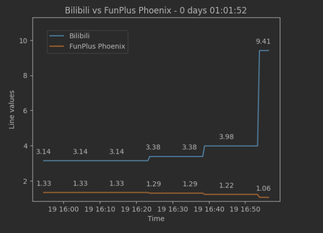
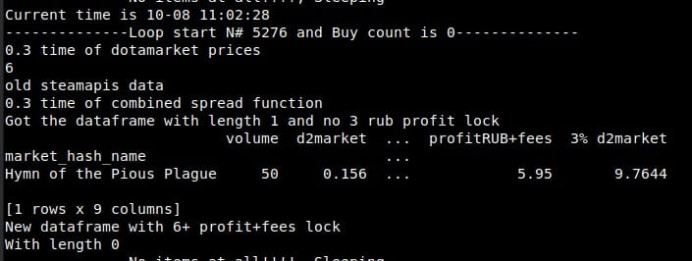
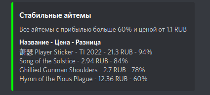
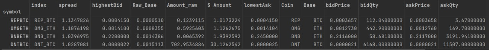
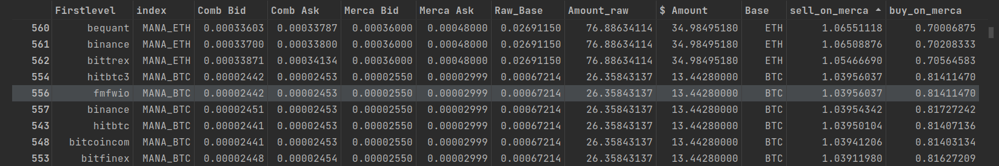

* [Парсер линии букмекера
](#парсер-линии-букмекера)
* [Бот для авто покупки игровых айтемов с биржи
  ](#бот-для-авто-покупки-игровых-айтемов-с-биржи)
* [Анализ и поиск арбитража на криптовалютных биржах](#анализ-и-поиск-арбитража-на-криптовалютных-биржах)

****
## Парсер линии букмекера
#### Стек: python selenium bs4 pandas matplotlib sqlite3
Парсер использует **selenium** для рендеринга js сайта букмекера. Каждые 30 секунд запрашивается 
html страница с браузера и с помощью **bs4** собираются все букмекерские линии на странице. Все
данные форматируются в словарь вместе с таймстемпом и загружаются в базу данных **sqlite**. 

Имея полученные данные я построил график с помощью **matplotlib**.

  

****
## Бот для авто покупки игровых айтемов с биржи
#### Стек: python requests pandas discord

Каждые пару секунд бот запрашивает данные с платного api **steamapis** и api биржи айтемов. 
После, с помощью **pandas** данные распаковываются, очищаются и приводятся в
одну таблицу по которой цены с двух бирж сравниваются по марже и по возможной прибыли.
В случае если прибыль и маржа выше минимального порога то айтем будет автоматически куплен. 

  

Так же был сделан бот для дискорда который просто выводил в удобной таблице
названия предмета и прибыль.

  

****
## Скрипты для поиска арбитража на криптовалютных биржах
#### Стек: python requests pandas ccxt

C помощью библиотеки **ccxt** собираются тикеры из более
чем 50 бирж. С помощью **pandas** данные очищаются и нормализуются. 
Рассчитывается глубина ордербуков, и выводятся пары тикеров показывая бид/аск спред, 
а так же возможную сумму сделки на определённую глубину ордербуков.

  

  

****

